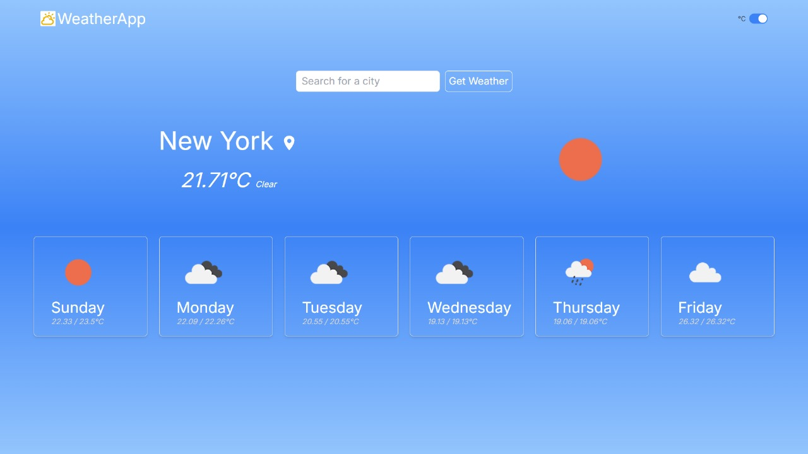

# Weather Forecast App

This is a simple and intuitive weather forecast application built with React. The app allows users to search for the current and 5-day weather forecast for any city around the world. On the initial load, it displays the weather data for a default city ("New York"), but users can easily search for other cities using the search bar.
## User Interface


## Run Code Locally

Navigate to the folder
- Install libraries using cmd

```bash
  npm install
```
- Deploy code locally
```bash
  npm run dev
```

## Key features


- **Real-time Weather Data**: Fetches the latest weather data, including temperature, conditions, and weather icons, from the OpenWeatherMap API. 
- **5-Day Forecast**: The app provides a forecast for the next 5 days, showing one data point per day from OpenWeatherMap’s 3-hour forecast data.
- **Responsive Design**: The user interface is responsive and clean, ensuring it looks good on both desktop and mobile devices.
- **Custom Hooks**: A custom React hook (useWeather) is used to fetch weather data efficiently and manage loading and error states.
- **API Integration**: The app integrates with OpenWeatherMap’s API to fetch weather information based on the city name, handling both current weather and 5-day forecasts.


## API Used

 - [5 day weather forecast](https://openweathermap.org/forecast5)
 - [Searched City weather](https://openweathermap.org/current)
 - [Dynamic List of cities](https://www.geonames.org/export/geonames-search.html)

